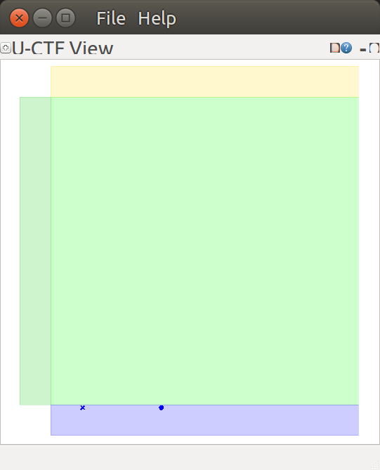

# Run the example

After setting up your system running the example will make sure everything works as expected.

## Environment setup

In order to use the installed software some environment variables need to be setup.
This has to happen for each terminal:

Use the appropriate setup from either your [source](../install_source/readme.md) or [binary](../install_binary/readme.md) installation. 

You can check the values of the environment variables with:

```console
env | grep "GAZEBO\|ROS" | sort
```

For more information on these environment variables please see the [ROS](http://wiki.ros.org/ROS/EnvironmentVariables) / [Gazebo](http://gazebosim.org/tutorials?tut=components) documentation.

Each of the following subsections should be executed in a separate terminal and they should continue to run until the end of the example.

## Start Gazebo

To start the Gazebo simulation with this scenario call:

```console
roslaunch uctf uctf.launch
```

At that point the Gazebo world will only contain the environment (game cube, team and penalty areas) but no vehicles yet.

## Run all vehicles on the same machine

First all vehicles will be run on the same machine to keep the setup simple.

### Spawn the vehicles

The two scripts `spawn_blue` and `spawn_gold` can be used to perform the following tasks:

* Spawn the vehicle models in the Gazebo simulation.
  By default the scripts create 25 quadcopters and 25 fixed wings.
  But a subset of these ids (1 - 50) can be passed to reduce the set.
  For information about the unique vehicle ids please see the [intro](../intro/readme.md)

* For each vehicle a custom init script for PX4 is being generated which contains specific port numbers.

* For the set of spawned vehicles a single ROS launch file is being generated.
  This launch configuration starts a PX4 controller as well as a MAVLink-to-ROS bridge for each vehicle.

For this example we will only spawn two vehicles (one quadcopter (1), one fixed wing (26)) for a single team and automatically start the generated `roslaunch` file:

```console
spawn_blue 1 26
```

### 2D visualization

Since the vehicles are so small compared to the environment size it is impossible to observe them all at the same time in Gazebo.
A simplified 2D visualization (which is not to scale) can provide that overview as a `rqt plugin`:

```console
rqt_uctf
```

The quadcopters are visualized as crosses while the fixed wings are depicted as a circle.



### Use QGroundControl

The ground control station provides even more information and has the ability to also interact with the vehicles.
For this example the QGroundControl application must be running and be connected to the teams which are being controlled:

```console
qgroundcontrol
```

To connect it with the port of the *blue* team the following steps are necessary:

* Open the preferences (click the icon with the "Q" in the top left corner)
* Select "Comm Links"
* Select "Add"
* Select `UDP` as the type of the connection
* Enter a name, e.g. `Blue team`
* Enter `14000` as the listening port (the *gold* team uses `14001`)
* Select "Ok"
* Select the newly created connection and click on "Connect"

Now you should see both vehicles at a location in Zurich, Switzerland (which are the default GPS coordinates of the PX4).
All vehicles have the same shape in this application despite one of them being a quadcopter.

At this point you can control the vehicles from `qgroundcontrol` like they were real vehicles.

#### Fly

To get started quickly. 

For the quadcopters: First arm them and then takeoff. You can also create a mission and upload it to the vehicle via the standard mission interface. 

For the planes, the quickest way to takeoff is to `arm` the vehicle then set it to RTL mode.

Note: Not all commands from `qgroundcontrol` get through and they might require repeated commands. You can watch the console of the drones' spawn command to see if the command was received.


<!--
### Start example controller

The two scripts `control_team_blue` and `control_team_gold` implement a simple behavior using the ROS topics and services provided by each vehicle.
Each vehicle publishing state information is automatically being armed and then flies a short mission which consists of a takeoff command and two waypoints in the middle of the game cube.

For this example we will only start the controller for the *blue* team:

```console
control_team_blue
```

After starting the script the vehicles should start their missions and fly around for some time before landing at their current location.


## Run vehicles on separate machines

Since a single machine can currently only run a few instances of the PX4 the following steps will run the vehicles across multiple machines.
Before starting the vehicles the simulator must be running as described above in the subsection *Start Gazebo*.

### Spawn some vehicles on a separate machine

First set the environment variable to point to the ROS master running on the simulator machine:

```console
export ROS_MASTER_URI=http://<host-running-gzserver>:11311
```

If necessary declare the hostname or IP address of this machine under which it is reachable from the simulator machine.
For more information about these environment variables please see the documentation about the [ROS network setup](http://wiki.ros.org/ROS/NetworkSetup).

```console
export ROS_HOSTNAME=<this-hostname>
export ROS_IP=<this-ip-address>
```

When spawning the vehicles we need to pass the IP address of this machine so that Gazebo knows where to send the MAVLINK communication to:

```console
spawn_blue 2 27 --mavlink-addr <this-ip-address> --launch
```

---

Next: [Program your own team](../program_team/readme.md)
-->
